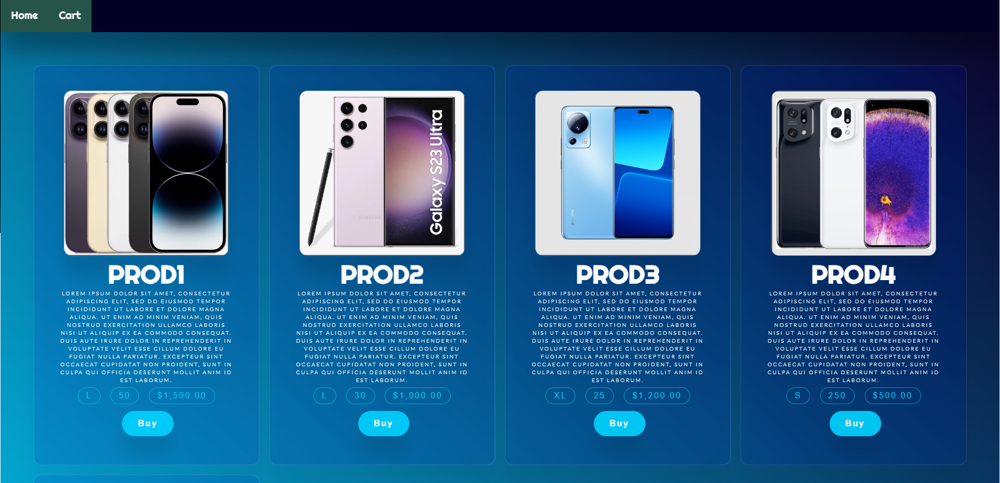
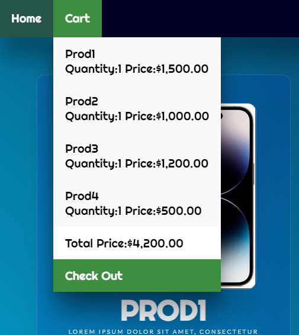
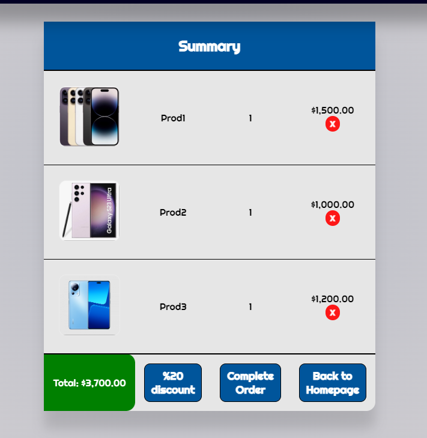

# Case

A case that I developed with Angular for Orte Company.

## Development server

First install all dependencies with `npm install` and run `json-server --watch prdouct.json` in api directory after that run `ng s -o` to start. Navigate to `http://localhost:4200/`. The application will automatically reload if you change any of the source files.

## Usage
-List all items from api. 
-Adding items to cart. 
-Total price, quantity and unit name is displayed on cart button. 
-Delete, apply discount and complete order are the functions that are available on the summary page. 

## Screenshots

